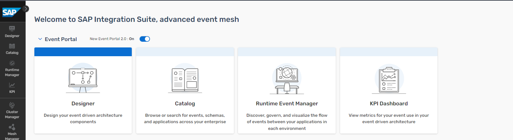

# Integration Suite Forum - Experience event-driven integration with advanced event mesh

## Description

SAP Integration Suite, advanced event mesh is SAP's flagship event broker. 

Actually, it is more than just that: it allows you to create meshes of event brokers and to use powerful eventing platform, operations and event management features. Explore these powerful features of SAP Integration Suite, advanced event mesh. 

Start with core event-driven architecture elements like queues and topics, then dive into advanced topics and filtering to simulate a social media–like experience. Try out advanced capabilities such as event replay. Finally learn about the features and tools that allow you to achieve the event-driven hockey stick.

## Overview

SAP Integration Suite, advanced event mesh is a fully managed event streaming and management service that enables enterprise-wide and enterprise-grade event-driven architecture. It is a full blown, general purpose event mesh. AEM offers enterprise-grade performance, reliability, security and governance. It scales to very large use cases – and very means very very very in this case.

- Advanced Event Mesh is a distributed mesh of event brokers that can be deployed across environments, both in the cloud and on-premise
- It offers a full purpose set of eventing services covering all relevant use cases
- AEM supports event streaming, event management and event monitoring
- Brokers fully scale as required and come in different broker sizes to perfectly fit different needs

SAP Integration Suite, advanced event mesh

- is a general purpose, multi-site EDA platform and portal
- allows for SAP to SAP, SAP to Everything and Everything to Everything scenarios
- supports distributed networks of event brokers deployed in different clouds and on-premises
- can be deployed in your cloud of choice or in your on premises K8S
- provides sophisticated authentication and security features like Kerberos, OAuth or TLS
- offers fine-grained filtering options
- allows for real-time monitoring, capacity insights and distributed tracing
- provides support for all relevant protocols like JMS, REST, AMQP and MQTT, plus SMF.
- allows to start small and upgrade to bigger T-shirt sizes when your business grows
- provides an outstanding performance up to billions of events per day

SAP Integration Suite, advanced event mesh features touched, some just shortly, some in more detail, include:

- SAP Integration Suite, advanced event mesh queues
- SAP Integration Suite, advanced event mesh Cluster Manager
- SAP Integration Suite, advanced event mesh Mesh Manager
- SAP Integration Suite, advanced event mesh Event Designer and Event Management
- SAP Integration Suite, advanced event mesh Try Me! tool
- SAP Integration Suite, advanced event mesh Event Portal

## Requirements

- Understanding the basics of event-driven architectures, namely events, queues, topics, event subscriptions ...
- You would be able to execute most of the exercises without prior experience by just following the descriptions. For taking value out of the chance to explore Advanced Event Mesh some experience with event-driven architectures is recommended.

## Exercises

Preparation and Setup

- [Getting Started](exercise/ex0/)

SAP Integration Suite, advanced event mesh

- [Exercise 1 - Explore SAP Integration Suite, advanced event mesh](exercise/ex1/)

    - [Exercise 1.1 - Log into Advanced Event Mesh and Explore it](exercise/ex1#exercise-11---log-into-advanced-event-mesh-and-explore-it)
    - [Exercise 1.2 - Create a Queue in Advanced Event Mesh ](exercise/ex1#exercise-12---create-a-queue-in-advanced-event-mesh)
    - [Exercise 1.3 - Create a Subscription in Advanced Event Mesh](exercise/ex1#exercise-13---create-a-queue-subscription-in-advanced-event-mesh)
    - [Exercise 1.4 - Send an event from the Try Me! Tool to your Topic](exercise/ex1#exercise-14---send-an-event-from-the-try-me-tool-to-your-topic)

- [Exercise 2 - Topic Hierarchies](exercise/ex2/)

    - [Exercise 2.1 - Learn about Topic Hierarchies and Wildcards](exercise/ex2##exercise-21-learn-about-topic-hierarchies-and-wildcards)
    - [Exercise 2.2 - Practice Topic Hierarchies and Wildcards using Try Me !](exercise/ex2##exercise-22-practice-topic-hierarchies-and-wildcards-using-try-me----berlin-edition) 

- [Exercise 3 - Persistent and Non-Persistent Quality of Service](exercises/ex3/)

    - [Exercise 3.1 - Learn about Persistency and QoS](exercise/ex3#exercise-31-learn-about-delivery-modes-persistency-and-quality-of-service)
    - [Exercise 3.2 - Experimenting with Persistency](exercise/ex3#experimenting-with-persistency)

- [Exercise 4 - Event Replay](exercise/ex4/)

    - [Exercise 4.1 - Learn about Replay](exercise/ex4/README.md#exercise-41-learn-about)
    - [Exercise 4.2 - Experimenting with Replay](exercise/ex4/README.md#exercise-42-experimenting-with-replay)

- [Exercise 5 - The Event-Driven Hockey Stick](exercise/ex5/)

    - [Exercise 5.1 - Learn about the Event-Driven Hockey Stick](exercise/ex5/README.md#exercise-51-learn-about)
    - [Exercise 5.2 - Explore Events in the SAP Business Accelerator Hub](exercise/ex5/README.md#exercise-52-explore-business-accelerator-hub)
    - [Exercise 5.3 - Experiment with the Event Portal](exercise/ex5/README.md#exercise-53-experimenting-with-replay)

## User Data and Password

In order to log into Advanced Event Mesh, you can use the below email address with XXX replaced with your group number.

handson_XXX@education.cloud.sap (e.g. handson_012@education.cloud.sap)

The password will be provided to you by the moderators.

## Background Material

In case that you would like to dig deeper into event-driven architecture: a lot of material to get up to speed with SAP Integration Suite, advanced event mesh and EDA in general is available. Please find a selection below:

- Introduction Slide Decks

    - [Discover EDA](material)
    - [Start your journey to EDA with SAP](material)
    - [AEM Roadmap](material)

- Blogs

    - [AEM Blog Post Collection](https://community.sap.com/t5/technology-blog-posts-by-sap/sap-integration-suite-advanced-event-mesh-blog-collection/ba-p/14111943)

- Tutorials and Missions

    - [Discovery Center Mission: Get started with AEM](https://discovery-center.cloud.sap/missiondetail/4582/4870/)

- Videos

    - [Devtoberfest 2024: Discover SAP Event Sources for Advanced Event Mesh](https://www.youtube.com/watch?v=NujHueCBDOw)
    - [Devtoberfest 2025: Hands-on session: practival demonstration of the Event Add-On for ERP](https://www.youtube.com/watch?v=vwzqNLISvHo)

- Documentation

    - [Help](https://help.pubsub.em.services.cloud.sap/Cloud/cloud-lp.htm)
    - [SAP Discovery Center - AEM](https://discovery-center.cloud.sap/serviceCatalog/advanced-event-mesh?region=all)
    - [Advanced Event Mesh Tutorials](https://help.pubsub.em.services.cloud.sap/Cloud/ggs_signup.htm)
    - [SAP EDA Strategy Paper](https://d.dam.sap.com/a/LFK8XBY/SAP%20EDA%20Extended%20Paper%20101424%20v7.pdf?rc=10&inline=true)

## Getting Started

Please continue with [Exercise 0](exercise/ex0/)

## How to obtain support

Support for the content in this repository is available during the actual time of the online session for which this content has been designed. Otherwise, you may request support via the [Issues](../../issues) tab.

## License
Copyright (c) 2025 SAP SE or an SAP affiliate company. All rights reserved. This project is licensed under the Apache Software License, version 2.0 except as noted otherwise in the [LICENSE](LICENSES/Apache-2.0.txt) file.
