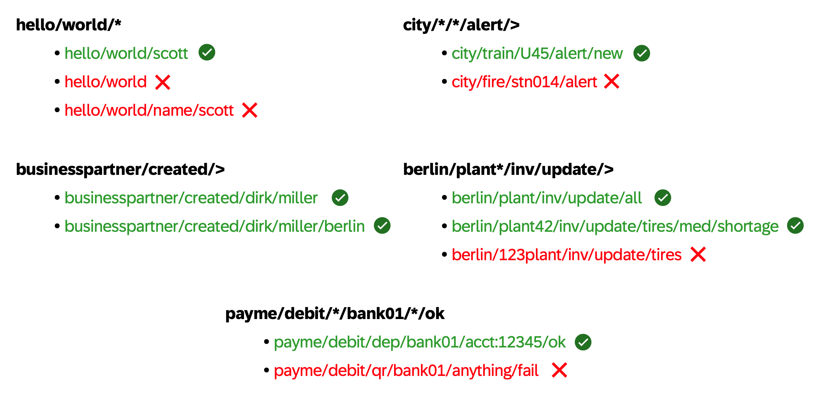
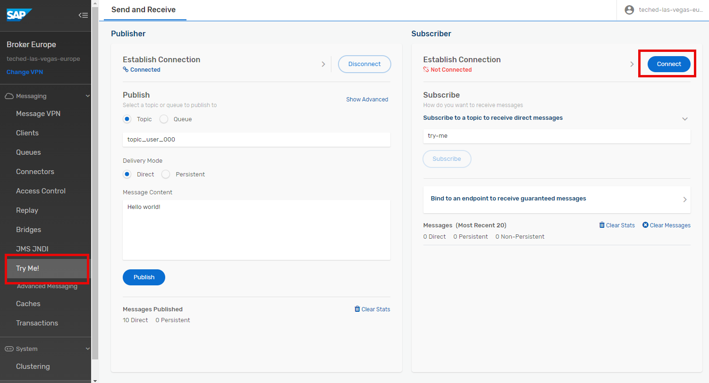
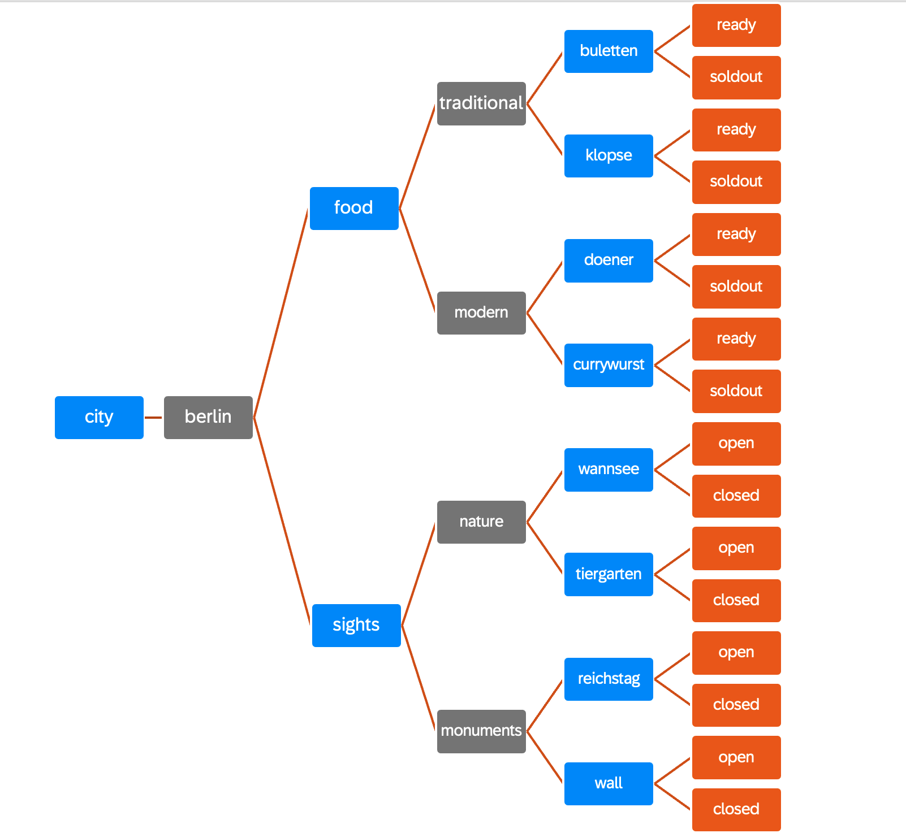
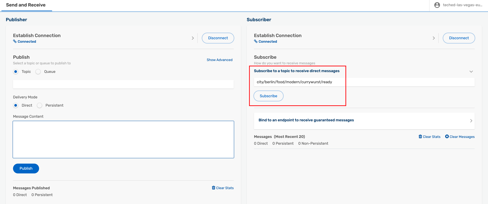
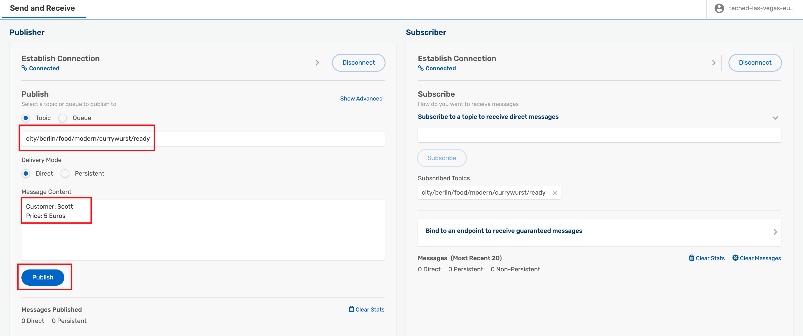
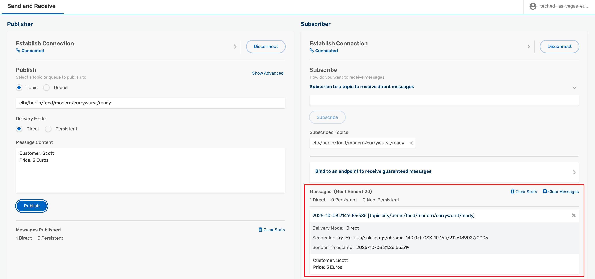
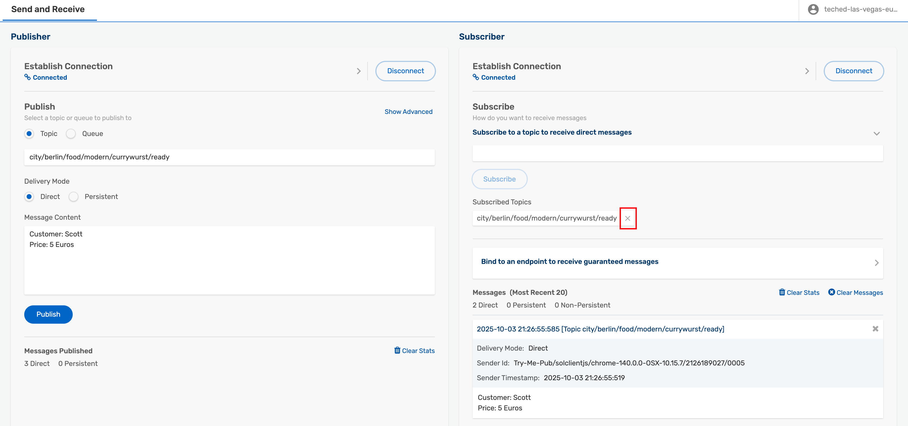
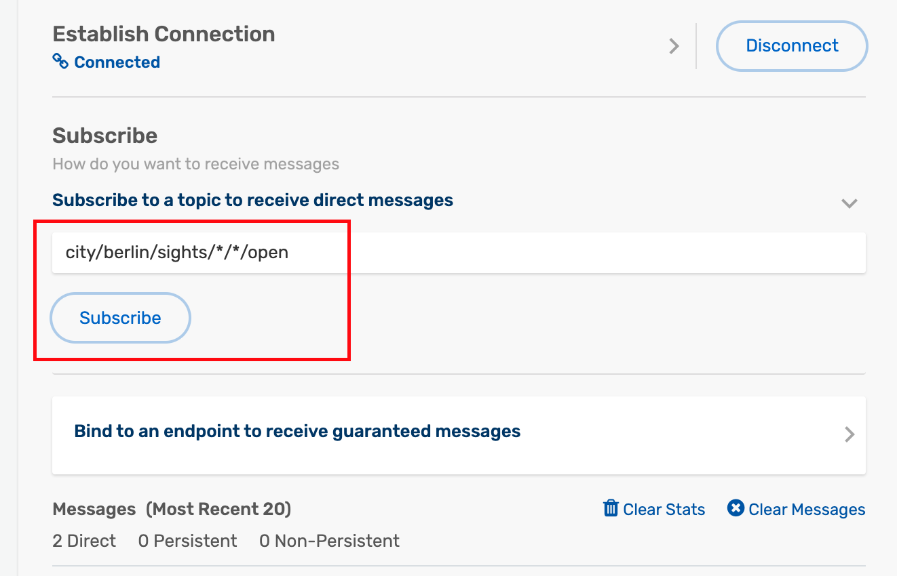
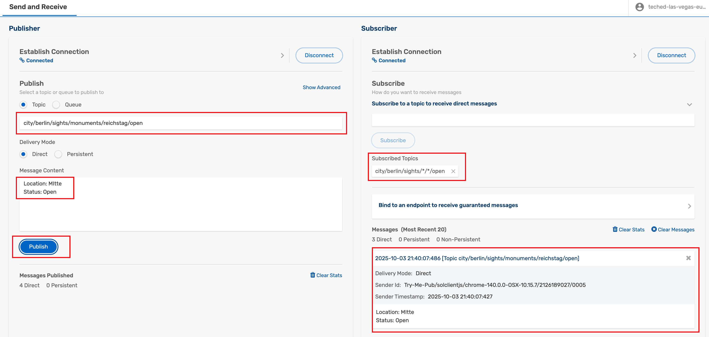

# Exercise 2 - Explore Topic Hierarchies and Wildcards

After completing these steps you will have learned about <b> topic hierarchies and wildcards </b> and how to use them

## Exercise 2.1 Learn about Topic Hierarchies and Wildcards

Advanced Event Mesh supports a hierarchical topic structure, which means you can be very descriptive in defining your topic. Use it to describe the <b>contents/intent of your message payload data </b>. 

<b> No need to use flat, coarse-grained topic labels like other brokers. </b>

### Topics

Check out this seven minute video for more information, if wanted: [All about AEM Topics](https://www.youtube.com/watch?v=PP1nNlgERQI)

Each and every message can be published to a unique topic, depending on the event metadata. Some examples of valid AEM topics are:

- hello/world/aem
- acme/taxi/rider/hail
- city/train/1234/alert/stopped
- mfg/plant42/inv/update/p12345667
- payme/debit/qr/bank01/f89a09-2b9c065a3/ok

Or for events originating from SAP S/4HANA:

- ce/sap/s4/beh/salesorder/v1/SalesOrder/Changed/v1
- ce/sap/s4/beh/businesspartner/v1/BusinessPartner/Created/v1
- ce/sap/s4/beh/workcenter/v1/WorkCenter/Created/v1

### Subscription Wildcards

Because published topics can be so variable and dynamic, subscribers can use wildcards to match a single subscription to multiple published topics. AEM supports two different types of wildcards:

- <b>Single-level wildcard</b>, 0-or-more chars, matches up to the next level /.
     - Can be used with a prefix e.g.: abc*, but not a suffix.
- <b>Multi-level wildcard</b>, matches one-or-more levels.
     - Must occur at the end of the topic subscription.

Some examples of AEM topic subscriptions, and topics that they match:

## Exercise 2.2 Practice Topic Hierarchies and Wildcards using Try Me ! - Berlin Edition

Now that we have learned about topic hierarchies and have a great tool like Try Me ! at hand. Let's play around with topic hierarchies.

For that, we will use Berlin topics ... gives you the chance to learn about topic hierarchies and the city at the same time.

1. Go to "Try Me!-Tool" used in exercise 1.

2. In a next step connect both Publisher and Subscriber.

Click on the connect buttons. Potentially you might still be connected from the last exercise.

Clean up your Subscribed Topics so that you are not subscribing to any topics any more.

3. Check out the hierarchical categorization of <b> Berlin-related </b> topics below
   

Now try out different combinations of publishing to a topic and listening to a topic and see which events you receive.

> Note: There are two options for you to do the steps described below - if you all publish to the same topic, others will receive your event as well. Which is good since this is the concept of topics.
>
>  Maybe think about adding some message if you want others to read the event - something like "I like Currywurst!" while sending it to the currywurst topic could make sense 
>
> If you want to play around just for yourself, add your number to the topic, ideally at the beginning. Make sure you add it when subscribing as well.
> 
> Instead of city/berlin/food/modern/currywurst/ready
> publish to or listen to XXX/city/berlin/food/modern/currywurst/ready
> where you replace XXX with your number 
> 

4. Register the consumer to listen to the currywurst topic - we just want to learn about currywurst being ready

For this subscribe the consumer to the topic <b>city/berlin/food/modern/currywurst/*</b>

5. Send a currywurst.ready event to the topic city/berlin/food/modern/currywurst/ready

Go to the Publisher, add a payload to the message field (e.g. medium spicy currywurst for Scott), put city/berlin/food/modern/currywurst/ready into the topic field and click Publish

You should receive the message.

6. Now we want to learn about all sights being open

- Go to the Subscriber
- delete the topics you are listening to

- Subscribe to city/berlin/sights/\*/\*/open

- Send a reichstag.open event to city/berlin/sights/monuments/reichstag/open

7. Try out a few combinations on your own and see what works and what does not

To make this easier for you, find the topics below for copy and paste.

- city/berlin/sights/monuments/reichstag/open
- city/berlin/sights/monuments/reichstag/closed
- city/berlin/sights/monuments/wall/open
- city/berlin/sights/monuments/wall/closed
- city/berlin/sights/nature/wannsee/open
- city/berlin/sights/nature/wannsee/closed
- city/berlin/sights/nature/tiergarten/open
- city/berlin/sights/nature/tiergarten/closed
- city/berlin/food/traditional/buletten/ready
- city/berlin/food/traditional/buletten/soldout
- city/berlin/food/traditional/klopse/ready
- city/berlin/food/traditional/klopse/soldout
- city/berlin/food/modern/doener/ready
- city/berlin/food/modern/doener/soldout
- city/berlin/food/modern/currywurst/ready
- city/berlin/food/modern/currywurst/soldout

## Summary

You've now explored topic hierarchies and wildcards.

Continue to - [Exercise 3 - Persistent and Non-Persistent Quality of Service](../ex3/README.md)
