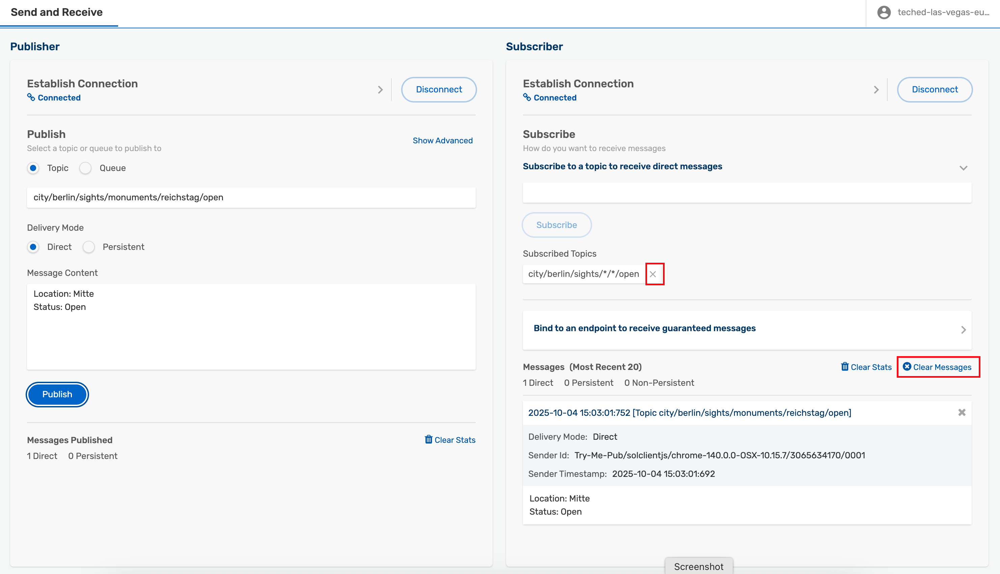
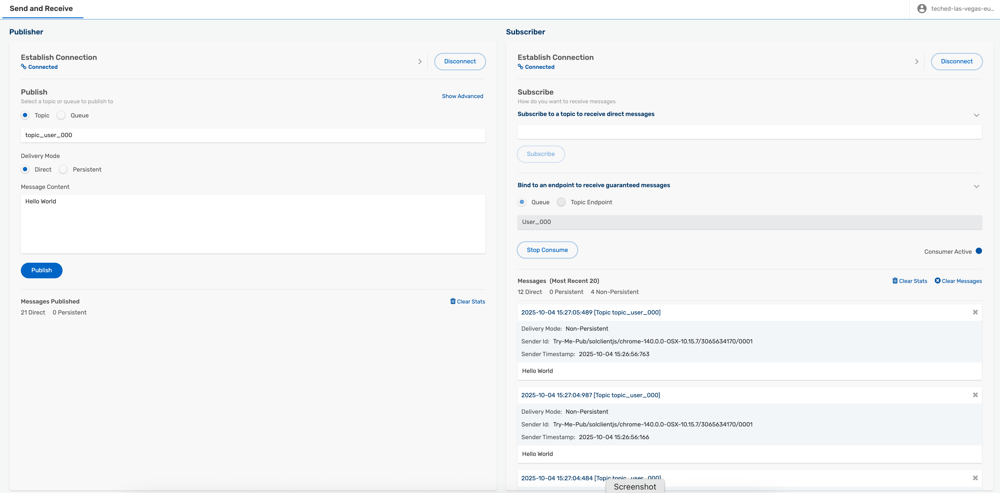
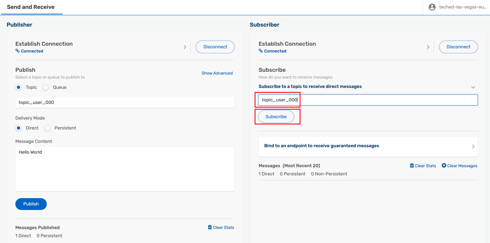
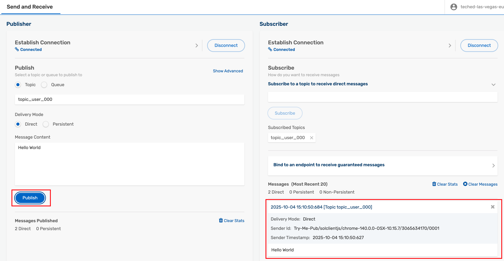
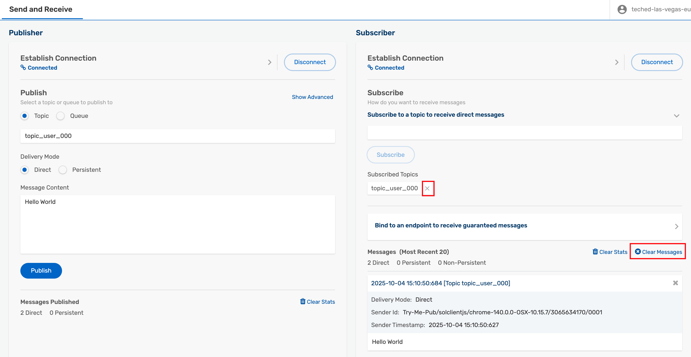
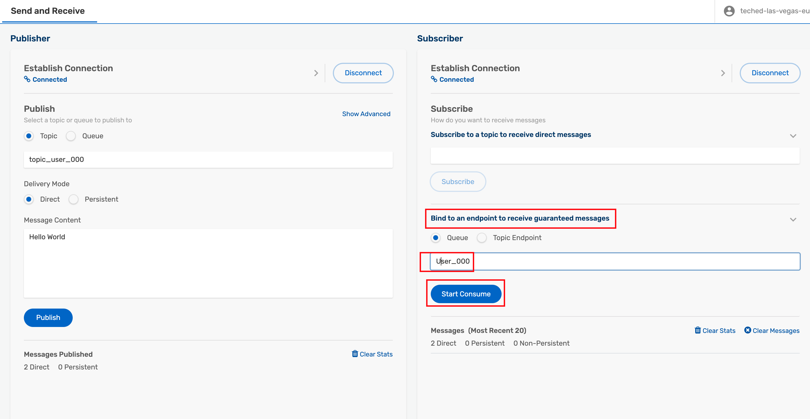

# Exercise 3 - Persistent and Non-Persistent

After completing these steps you will have learned about delivery modes, persistency and quality of service.

## Exercise 3.1 Learn about delivery modes, persistency and quality of service

Advanced Event Mesh supports multiple delivery modes for your events and messages. In this section we will explore what they are and how to use them.

### Persistence

Persistence refers to the <b>Quality-of-Service (QoS)</b> of event messages, which can be classified as <b>Persistent (Guaranteed)</b> or <b>Non-Persistent</b>.

<b>Persistent</b>: Event Messages are considered persistent if they are placed onto non-volatile storage media after they arrive on the broker. The broker's Data Plane stores a message if the message arrives with the `Persistent Delivery Mode` set to `Persistent`, or if a queue or durable topic endpoint has subscribed to a topic where messages are persisted regardless of the `Persistent Delivery` Mode flag setting in the message.

<b>Non-Persistent</b>: If an event message is sent with `Persistent Delivery Mode` set to `Direct`, which is synonymous with `Non-Persistent`, the message is only placed onto the non-volatile storage media if the message is subscribed by a Queue or a Durable Topic Endpoint. 

Messages flagged as `Persistent` result in an acknowledgment message being sent back to the producer after the message is stored.

 In other words, AEM broker distinguish between the sender's persistency mode controlled by the flag on the message and the subscriber's persistency mode controlled by the existence or non-existence of a queue or topic-endpoint.

 If a publisher wants to make sure that they can detect (and react to) any messages being lost on the network, they should set the `Persistent Delivery Mode` to `Persistent` on the message they are publishing. This will cause the <b>broker to acknowledge event messages it has successfully received</b> (and processed) or sent a negative acknowledgment if anything went wrong.

 If a subscriber wants to make sure they do not loose any event messages, then they should always set up a queue (or topic endpoint) and add their subscription on that endpoint. We refer to this as <b>topic to queue mapping</b>. This will ensure that all event messages matching the subscriptions will be stored in the persistent endpoint on the broker and delivered to the consumer in a <b>lossless/guaranteed way</b>. Consumers are then expected to acknowledge the successful receipt of each message, after which (and only under that circumstance) the broker will remove the event message from the queue/endpoint.

 <b>Persistent message delivery</b> is also referred to by other names depending on the protocol or context, here are some synonyms and similar terms:
 - `Guaranteed Messaging`, `QoS1` (and `QoS2`), `at-least-once delivery` (and sometimes `exactly-once delivery`)

 <b>Non-Persistent message delivery</b> is also referred to by other names depending on the protocol or context, here are some synonyms and similar terms:
 - `Direct Messaging`, `QoS0`, `at-most-once delivery`

### Experimenting with Persistency

In this section we are going to play a bit around with persistency to see what this really means in a practical example using built-in <b>Try-Me tool</b>.
So, let's open up the `Try-Me` tool used in the last exercise.

1. Remove all subscriptions from your subscriber and clear the messages

2. Enter the topic into the topic field for the publisher. Use topic_user_XXX as the topic, and replace XXX with your group/participant number. And publish one message as direct.

> Did you receive anything? 
No, of course not. Our Subscriber is not subscribed to the topic. Let's go ahead and add the subscription.

3. Enter the topic into the topic field for the subscriber. Use topic_user_XXX as the topic, and replace XXX with your group/participant number. And hit "Subscribe".

> Did you receive anything now? 
No, still not. Our subscriber is using direct/non-persistent mode to subscribe directly to the topic on the broker. There's no persistency endpoint configured, so we don't receive any messages that were published while we were not subscribed or connected. 
Let's go ahead and publish another message.

4. Hit publish one more time.

> Now we've received a message, because both our publisher and subscriber are connected at the same time! This is non-persistent messaging, sometimes also referred to as best-effort messaging. <b>Publishers and Subscribers need to be connected at the same time and reachable</b> so that the messages can be delivered immediately from memory (meaning no network issues). This is the fastest mode, but it's not guaranteed to be lossless.

5. Publish a couple more messages, then clear your subscribers' messages and remove the topic subscription.

13. Click on `Bind to an endpoint to receive guaranteed messages`, then enter the queue name: User_*** (replace *** with your number) in the field for the queue.

14. Click on `Start Consume`.

> What happened? 

Did you receive multiple messages just now? 

How is that possible? 

Well, the answer lies in the <b>persistent delivery mode</b> aka guaranteed messaging and <b>the queue we set up earlier today</b>. We also added a subscription to this queue to our topic.

Now while we were happily experimenting with the `Try-Me` tab here publishing to our topic and seeing if we receive any messages, all those messages were simultaneously attracted to our queue by our previously set up subscription and stored there for later consumption. 

Now when we started our Queue consumer on our Try-Me tab just now, we just <b>received all those stored messages</b> that were published between when we set up the queue and assigned the subscription and now. 

This is persistent messaging, <b>publishers and consumers don't need to be online or processing messages at the same speed</b>. The broker will securely store all messages matching the queue's subscription and deliver it securely to the consumer when it comes online or is ready to process messages.

## Summary

You've now explored different delivery modes on the consumer side and the effect they have on message delivery and message loss.

Continue to - [Exercise 4 - Event Replay](../ex4/README.md)
