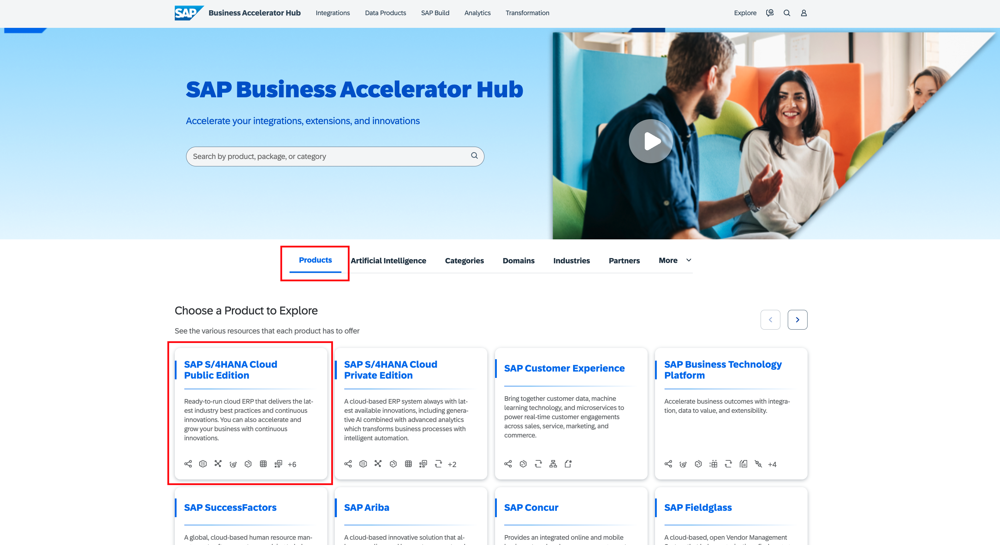

# Exercise 5 - The Event-Driven Hockey Stick

After completing these steps you will have learned about how to scale event-driven architecture and why it is also nicknamed as Social Media of the Enterprise.

## Exercise 5.1 Learn about The Event-Driven Hockey Stick

We have today learned some of the basics of event-driven architecture. You have seen some strength that make EDA so powerful:

- loose coupling
- filtering
- buffering
- scale
- publish / subscribe

Typically, initial EDA projects are driven by a specific integration department or a team with technical know how. During these projects EDA know how is built up and the teams learn how to operate EDA environments. Which is different, since a lot of things happen in parallel.

Customers start with a few use cases. Then, driven by a central team, additional use cases are added. The beauty is that you can simply add them to the same infrastructure.

What you really want after having built up EDA know-how is <b>exponential growth</b>: you want the EDA Hockey Stick. Now how do you get there?

That's simple - involve the people that have the business know-how and give them the chance to come up with EDA use cases. The idea is that the different business units can do two things:

1. They can look up available events that they can subscribe to. Based on these events they can build extensions and integrations that are valuable for them. SAP Build would allow business users to do this, in other areas they probably need technical expert guidance and support.
2. They can decide to make events available for others to use. Again, this could either be done by the business or could be done with tech expert support.

## Exercise 5.2 Explore Events in the SAP Business Accelerator Hub

The SAP Business Accelerator Hub documents available SAP standards events. It does so for different SAP cloud applications and on premise backends like SAP S/4HANA Public Cloud Edition, SAP S/4HANA Cloud Private Edition, SAP S/4HANA, SAP Success Factors solutions and plenty of additional SAP applications.

Go to the SAP Business Accelerator Hub by entering the following URL into you browser:

http://hub.sap.com

This will take you to the main page of the Business Accelerator Hub:

Now there are two ways really to look for available events:

1. Either via selecting your SAP <b>product</b> / event source

   
2. Or by clicking on <b>Categories</b> to look for all available events 

We will now take path 1, meaning we will look at available events for SAP S/4HANA Public Cloud Edition.

Go to SAP S/4HANA Cloud Public Edition and click on <b>Events</b>
.

You can now click around and look at available events if you want to. Then enter <b>*salesorder*</b>
 into the search field.
 

Click on SalesOrder events. You get an overview of available SalesOrder events.

Next click on <b>Event References</b>

You can now explore the payload and the header data of available SAP standard events for SalesOrder.

And if you want to, you can always go back and look for other available standard events.

The next picture gives you an indication on how you would be able to expose these events in your SAP S/4HANA Public Cloud system - this is nothing you can try today, still allows you get an impression:

First you see 4 event types getting exposed via a channel to AEM.

Then you see how you could select and add additional events to this channel.

## Exercise 5.3 Experiment with the Event Portal

The Event Portal provides cloud-based event management capabilities that improve developer productivity, enhance governance and compliance, facilitate improved collaboration across teams, and enable efficient design and analysis of event flows, ultimately leading to faster time-to-market and reduced errors in event-driven applications and services.

You can find documentation on the Event Portal [here](https://help.pubsub.em.services.cloud.sap/Cloud/Event-Portal/event-portal-lp.htm).

Event Portal supports modeling your EDA for the multiple operational environments that you maintain for your software development lifecycle. You can have multiple versions of applications, events, schemas, and enumerations, which enables you to maintain production versions while you develop and test new versions to extend and enhance your EDA at the same time.

Event Portal offers: 

- runtime discovery and cataloging of events
- schemas
- application interactions 

Event Portal includes several tools to help you design, manage, and govern your EDA:

- <b>Designer</b> helps you create and update all of the objects you use to design your EDA and configure queues that you can add and update on your operational event brokers.

- <b>Catalog</b> is a library of all the applications, events, schemas, and other objects in your organization's account in Event Portal.

- <b>Runtime Event Manager</b> helps you model your EDA using objects created in Designer or data collected from your operational event brokers. It also helps you create templates for queue configurations and client profile names, to make it easier to govern the resources configured on your event brokers and help developers configure client applications.

- <b>KPI Dashboard</b> displays key performance indicators (KPI) related to your event-driven architecture (EDA) to help you track the performance and efficiency of your EDA.

In the end the next excercises are free flow and are supposed to give you an overview of what the Event Portal offers. We will still provide a few ideas where to explore and what to look at a little deeper. <b>You are obviously not bound to this flow</b>. The different sections hold example data.

1. Start with the Catalog by clicking on <b>Catalog</b>

- you can for example look at which events an application subscribes to (go to <b>Applications</b> and click on the application name)

- or you can go to <b>Events</b> and look at the details of a specific event - which applications use it, what is the topic address ...
  

2. Go to the <b>KPI Dashboard</b> by clicking on KPI Dashboard

Here you can check which events are the most re-used ones.

## Summary

You've now explored how you scale your event-driven architecture.
